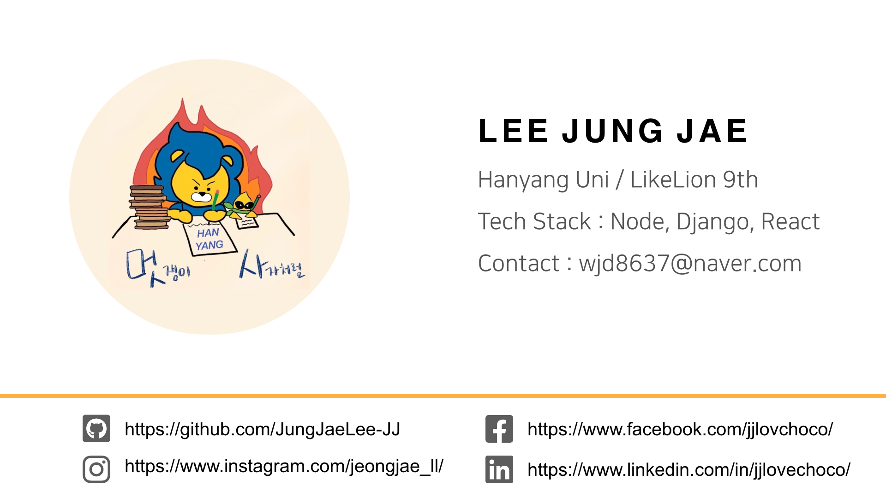

# 웹 기초와 HTML/CSS

## 주차 학습
아래의 사이트를 참고하여 강의를 수강하시면 됩니다.
- [Class Lion (웹 기초 ~ HTML/CSS 까지)](https://classlion.net/)

같이 들으면 좋은 강의(선택사항)
- [CSS - 생활코딩 (35강 flex 3 까지)](https://www.youtube.com/watch?v=ONcmkf07EuI&list=PLuHgQVnccGMDaVaBmkX0qfB45R_bYrV62)
- [HTML - 생활코딩 (~27강 HTML-form 파일 업로드 까지)](https://www.youtube.com/watch?v=OGFgdro160I&list=PLuHgQVnccGMDUzDDCKW-pCZQY-MMCX5yB)

## 주차 과제
자기만의 명함을 만들어봅시다. 이미지 태그를 사용하여 사진도 넣어보고, a tag로 페이스북, 인스타그램 등 본인의 sns 링크도 연결해봅시다. 처음 배우는 HTML, CSS지만 직접 사용하다보면 금방 익숙해 질 수 있습니다. '나는 프론트 개발자 안할껀데;;' 라는 생각은 접어두시고 웹의 기초를 맛본다고 생각해주세요!  

참고 코드로 **position이 absoulte**로 설정되어 있는 easy 버전과, **박스모델,flex 개념**을 알아야 하는 hard 버전을 올려놓았습니다. (easy는 1920px * 1080px 기준으로 디자인 및 개발하였으나 너무 커서 scale을 낮췄습니다.) 참고만 해주시고, 동일하게 작성하기보다는 본인만의 독창적인 명함을 만들어보세요. 

[XD 디자인 링크](https://xd.adobe.com/view/201755dd-1a62-4939-af55-07d6e3bd293d-7544/)

제출해주신 **명함을 3월 31일에 진행되는 중앙세션에서 "각자" 자랑**하고자 합니다. **개발자도구의 사용법**을 안다면, 잘 만들어진 웹 페이지를 보고 HTML과 CSS가 어떻게 적용되어 있는지 알 수 있고 css나 html을 실시간으로 수정 및 확인 할 수 있으니, 참고하시면 좋습니다. 장고를 배우면 해당 웹페이지를 응답하는 웹 서버를 제작할 예정이며, AWS EC2 배포를 배우면 직접 만든 사이트를 배포할 예정입니다. 

<kbd></kbd>

<kbd></kbd>

### 제출방법 및 기한
팀별 레포지터리에 week0/이름 으로 폴더를 만들고 index.html, styles.css 를 **3월 30일 밤 11:59**까지 업로드 해주세요. 
- ex) week0/이정재/index.html, week0/이정재/styles.css

### 참고할만한 사이트
- [웹에디터 코드샌드박스(Vanila JS로 생성 및 작업)](https://codesandbox.io/)
- [개발자도구 사용법 - (Element 탭 사용법만 익혀도 있는 괜찮음)](https://blogpack.tistory.com/756)
- [아이콘 다운로드 - material.io](https://material.io/resources/icons/)
