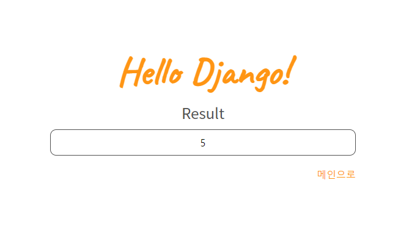

# Django 기초

## 주차 학습
멋사 강의를 참고하여 열심히 수강해 주세요.
- [Class Lion (Django 오리엔테이션 ~ Model 실습,  Template 상속 ~ Form)](https://classlion.net/)

### 참고할만한 사이트
내용이 부족하거나 더 공부하고 싶다면 아래 링크를 추천드려요.(선택사항)
- [7기 Django 교육자료 영상 스크립트 (BASIC 1-1. 기본환경 세팅하기~ BASIC 2-3. Word Counter 만들기 3)](https://www.notion.so/4eed5a2343bb4f09874fe6c56ea4ace8?v=138c8b8b488e42b6a2cc603714db9e4f)
- [장고걸스 튜토리얼](https://tutorial.djangogirls.org/ko/) 
- [점프 투 장고 교재 Wiki](https://wikidocs.net/book/4223)
- [Django 공식문서](https://docs.djangoproject.com/ko/3.1/)

## 주차 과제
1. 강의에서 진행하는 WordCount 과제를 완성해서 올려주세요.

2. 올라간 계산기 템플릿을 기반으로, 빈칸을 채워서 완성해주세요. 굳이 해당 템플릿 기반이 아니어도 상관없습니다 :)
   -   채우실  내용은 주석 형태 (# 작성할 내용)로 적어놓았습니다. 관련 파일은 다음과 같습니다. 
       -   example/settings.py, urls.py
       -   calculator/urls.py, views.py,
       -   calculator/templates/calculator/mycalculator.html, main.html 파일입니다.
  
  

    

### 제출방법 및 기한
팀별 레포지터리에 week2/이름 으로 폴더를 만들고(or 본인 브랜치에 week2 폴더를 만들고) 문제 풀이 코드를 **4월 27일 23:59**까지 업로드 해주세요. 
 
이때, calculator 파일의 경우 .gitignore 파일을 꼭 넣어주세요. [생성할 수 있는 사이트](https://www.toptal.com/developers/gitignore)(venv등 다른 파일이 올라가는 것을 막기 위함입니다. django, venv 등을 추가해주세요. )
- ex) week2/남민정/wordcount, week2/남민정/calculator

